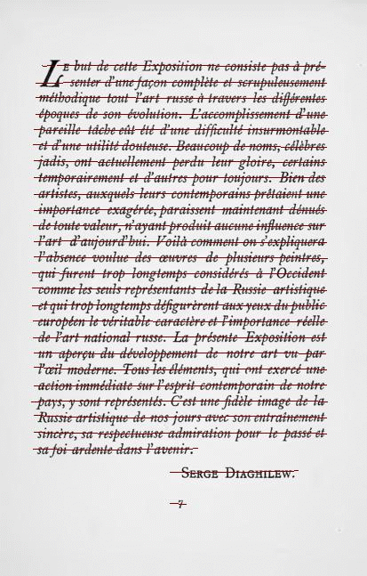

# Structured OCR

## About

Structured OCR is a line localization and text recognition tools using Deep Learning with PyTorch.



## Build status

[](https://travis-ci.org/belosthomas/socr)

## Get started

1. [Build and Install SOCR](https://github.com/belosthomas/socr/wiki/Build-and-Install-SOCR)
    1. [Linux](https://github.com/belosthomas/socr/wiki/Build-and-Install-SOCR#linux)
2. [Command line tools](https://github.com/belosthomas/socr/wiki/Command-line-tools)
    1. [How to recognize a page of text ?](https://github.com/belosthomas/socr/wiki/Command-line-tools#how-to-recognize-a-page-of-text-)
    2. [How to train/test with command line](https://github.com/belosthomas/socr/wiki/Command-line-tools#how-to-traintest-with-command-line)


## Setting up

### Requirements

 - If you want to use GPU, **NVIDIA Graphic Card with CUDA 8 minimum**, otherwhise use ```--disablecuda``` 
 - Python 3 with anaconda and pip
 - GCC and G++ Version 5 (even if it's not your default compiler)

Only on Windows :
 - Microsoft Visual C++ 14.0 (2015) is required. Get it with "Microsoft Visual C++ Build Tools": https://www.microsoft.com/en-us/download/details.aspx?id=48159

### Compilation

Use

```python3 setup.py install_requirements```

to install all the necessary requirements.
Then, to compile, run

```python3 setup.py build_ext --inplace```


## How to recognize a page of text ?

### Command line

Please make sure that the checkpoints .pth.tar files is present under the ```checkpoints``` folder, and make sur that the ```settings.cfg``` file correspond to yout model.

You can download some trained models and copy it to the checkpoints folder : 
[Download on DropBox](https://www.dropbox.com/sh/wvhdnldsq4652wx/AAA3iUDFWHVh56zPia10nwrQa?dl=0)

Then you can run : 

```./launch recognizer [your files] [your folders]  ...```

to extract the text of your images.

### API

See [example.ipnyb](examples/example.ipynb)

## How to train/test with command line

### Settings up the database

The first thinks you have to do before a training is to setup the datasets.

Modify the file ```datasets.cfg``` so it correspond to your data-sets. Currently, SOCR is compatible with the IAM Datasets and ICDAR Datasets.
See [datasets.example.cfg](examples/datasets.example.cfg) for a example.

### How to train/test the line recognizer ?

Execute : 

```./launch line --model dhSegment --name myDhSegmentTraining --bs 8 --lr 0.0001```

```./launch text --model resSru --name myResSruTraining --bs 8 --lr 0.0001```

to train the line localizator or the line recognizer. Change the parameters to whatever you want. Use ```./launch line --help``` for more help.
You can also modifiy the file ```settings.cfg``` for more configuration.


### Auto-saving

You can select a model using the ```--model [MODEL]``` argument, and give a custom name to a model by using ```--name``` argument.
When ```CTRL-C``` is pressed, the program will ask you to save the weight or not. The weights are saved under the checkpoints folder, with the given name as argument, or with the model name if no name is specified.
The programe will automatically load the good model.

In case of problem, a backup of the weights are made with the extension ```.autosave``` under the ```checkpoints``` folder.

### Multi-GPU

Use ```CUDA_VISIBLE_DEVICES=0,1``` to select the available GPU. SOCR will use all available GPU if you are training, or one GPU if you only evaluate.
The batch size need to be a multiple of the number of GPU.

**Warning :** SRU use a lot of power, and can exceed the maximum power indicated by NVIDIA. Please make sure that your power supply is enough good. If it is not, your PC may crash.

## Make a custom model

See [socr/models/README.md](socr/models/README.md)